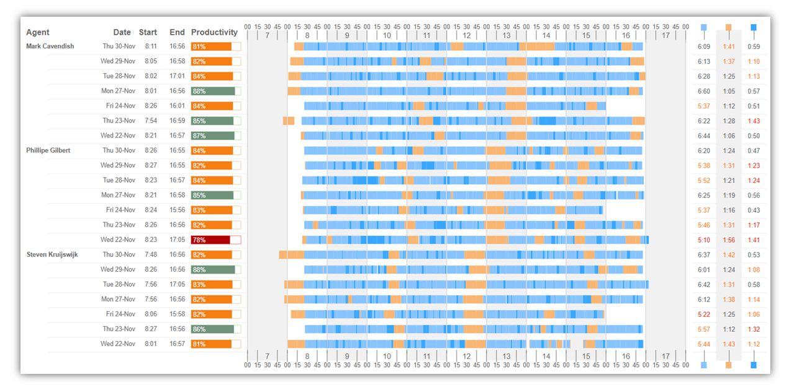

<!-- PROJECT LOGO -->
 

  

<h3 align="center">Deneb timeline visual</h3>

<!-- ABOUT THE PROJECT -->
## About

As I was in need of a specific timeline/gantt type of chart I decided to adapt the excellent Deneb Gantt visual made by Davide Bacci (Power BI Deneb Gantt chart). Given a sample dataset like this:

| Duration | full_name         | is_productive | is_work | status              | timestamp_date | timestampEnd     | timestampStart   | color   |
|----------|-------------------|---------------|---------|---------------------|----------------|------------------|------------------|---------|
| 131      | Mark Cavendish    | TRUE          | TRUE    | WrapUp              | 22/11/2023     | 22/11/2023 08:55 | 22/11/2023 08:53 | #39A7FF |
| 270      | Mark Cavendish    | TRUE          | TRUE    | Waiting             | 22/11/2023     | 22/11/2023 09:00 | 22/11/2023 08:55 | #87C4FF |
| 37       | Phillipe Gilbert  | FALSE         | FALSE   | Pause - Break (bio) | 22/11/2023     | 22/11/2023 09:00 | 22/11/2023 08:59 | #F9B572 |
| 50       | Steven Kruijswijk | TRUE          | TRUE    | WrapUp              | 22/11/2023     | 22/11/2023 09:00 | 22/11/2023 08:59 | #39A7FF |
| 157      | Steven Kruijswijk | TRUE          | TRUE    | WrapUp              | 22/11/2023     | 22/11/2023 09:02 | 22/11/2023 09:00 | #39A7FF |
| 239      | Mark Cavendish    | TRUE          | TRUE    | Waiting             | 22/11/2023     | 22/11/2023 09:03 | 22/11/2023 09:00 | #87C4FF |

It will generate an overview of timeseries in a layout where each row represents a timeline per agent and date. On the left, there is a summarization of date, starttime, endtime and productivity percentage. On the right, there is a summarization of the times grouped by the color of the status. In the middle, the series are rendered chronologically on a customizable timescale.

<!-- GETTING STARTED -->
## Customizing

To customize it to your own needs there are some signals in the spec you should check out first:

startHour: Starting hour of the timeline
endHour: End hour of the timeline
x_step: Width of 15min. blocks on the timeline
y_step: Height of each row
agentColumn, dateColumn, startColumn, endColumn, productivityColumn: Width columns on the left
summaryColumn: Width of the color summarization on the right

By playing with the different widths and start- and end hours you can adapt the visual easily to your own specific needs:
  
 
  
  

Quick and dirty overview of the different components of the visual:

  

Note that there is no filtering of the timeline series on the start- and end hours. This will let the logs spill over/outside of the scale. You could easily add a transform to mitigate this by filtering on the start and end hours. There is also quite a bit of conditional formatting hardcoded in the spec that ideally you should do more upstream, but it was a good opportunity to learn the ins and outs of Deneb.

You can find Davide Bacci's original Gantt chart [here](https://github.com/PBI-David/Deneb-Showcase/tree/main)
